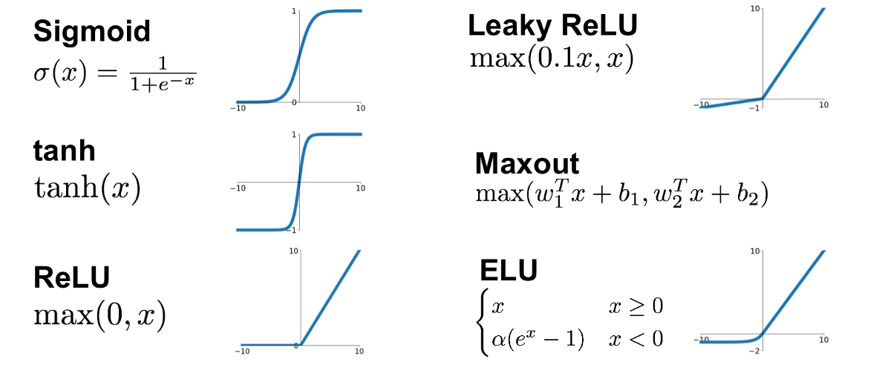
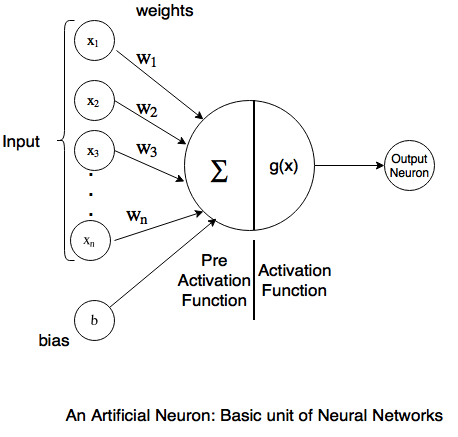
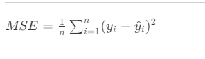
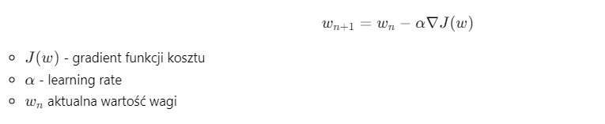

## CrossValidation
Bierzemy sobie wycinek danych jeden zapamiętujemy na pozostałych uczymy potem testujemy na tym zapamiętanym. następnie wybieramy kolejny inny wycinek i tak dalej, potem średnia i mamy wynik.

## Funkcje aktywacji

## Perceptron

## Softmax
- Funkcja ta służy do przejścia do przestrzeni prawdopodobieństwa aby na podstawie odpowiedzi sieci (logitsów) móc określić z jaką pewnością wybrał daną klasę. Tym **większa liczba** tym **większe prawdopodobieństwo** SoftMax mu przypisze
## MSE- błąd średniokwadratowy

<!-- $ MSE = \frac{1}{n} \sum_{i=1}^{n} (y_i - \hat{y}_i)^2 $ -->

jest powszechnie stosowaną funkcją straty (loss function) w uczeniu maszynowym i głębokim, szczególnie w problemach regresji. Oto kilka kluczowych zastosowań MSE:
- Ocena Wydajności Modelu: MSE może być także wykorzystywany do oceny wydajności modelu po jego wytrenowaniu, dając jasny obraz tego, jak dokładne są jego przewidywania.
- Optymalizacja Modelu:  W procesie uczenia sieci neuronowej, MSE pomaga w dostosowywaniu wag modelu tak, aby minimalizować błąd między przewidywaniami a rzeczywistymi danymi. Jest to realizowane poprzez proces zwany propagacją wsteczną (backpropagation).

## Backpropagation
Backpropagation składa się z dwóch głównych etapów: propagacji do przodu (forward pass) i propagacji wstecz (backward pass). Jej celem jest **minimalizacja** funkcji kosztu.

- Forward Pass:
    1. W tym etapie, dane wejściowe są przekazywane przez sieć od warstwy wejściowej, poprzez ukryte warstwy, aż do warstwy wyjściowej.
    2. Na każdym etapie, dane są transformowane przez funkcje aktywacji i wagi.
    3. Wynikiem jest przewidywane wyjście sieci.

- Backward Pass:
    1. Po obliczeniu wyjścia, obliczany jest błąd (na przykład przy użyciu funkcji straty, jak MSE).
    2. Ten błąd jest następnie "propagowany wstecz" przez sieć, co oznacza, że obliczamy, jak bardzo każda waga przyczyniła się do błędu.
    3. To jest realizowane przy użyciu reguły łańcuchowej z rachunku różniczkowego, aby obliczyć gradienty funkcji straty względem każdej wagi w sieci.
    4. Te gradienty są następnie używane do aktualizacji wag w procesie zwanym optymalizacją (na przykład przy użyciu algorytmu Gradient Descent).

- Kluczowe Aspekty Backpropagation:

    1. Backpropagation pozwala na efektywne obliczenie gradientów dla każdej wagi w sieci, co jest kluczowe dla procesu uczenia.
    2. Jest to podstawowy mechanizm umożliwiający uczenie się głębokich sieci neuronowych, umożliwiając dostosowanie wag na wszystkich poziomach sieci.
    3. Backpropagation wykorzystuje regułę łańcuchową z rachunku różniczkowego, co umożliwia obliczenie wpływu każdej wagi na końcowy błąd.
    4. Funkcje aktywacji w sieci muszą być różniczkowalne, aby backpropagation mogło działać, ponieważ potrzebujemy obliczać ich pochodne podczas etapu propagacji wstecz.

### Spadek gradientowy:

<!-- - $$ w_{n+1} = w_n - \alpha \nabla J(w)$$
    - $J(w)$ - gradient funkcji kosztu
    - $\alpha$ - learning rate
    - $w_n$  aktualna wartość wagi -->

- Gradient descent - ma za zadanie poprawiać wagi, czyli służy do nauki wag w warstwach sieci. Poprzez sterowanie parametrem alfa jesteśmy w stanie sprawić aby sieć się nie uczyła na pamięć.

- Stohastic gradient descent - parametr **momentum** wprowadza lekkie naprowadzenie na odpowiedni kierunek. Zezwala na "przyspieszenie"  gdzie spadek gradientu jest stromy, i zwalniać w płaskich regionach.

-  Mini batch gradient descent - operuje na małych zbiorach obrazów i na ich podstawie wylicza gradient, dzięki czemu trudniej jest wpaść na **minimum lokalne**

### Cross entropy loss
Jest to funkcja straty, stosowane tak aby jak najbardziej zwiększyć prawdopodobieństwo aby nasza sieć neuronowa poprawnie rozpoznawała klasy.
### ReLu
Jest to jedna z funkcji aktywacji. Jej zalety:
- prosta obliczeniowo: $max(0, x)$
- łatwa pochodna, gdyż dla $(x) -> 1$ a dla $0 -> 0$, dzięki czemu jest mniej podatna na problem zanikającego gradientu.
- wszystkie wartości ujemne wejściowe są zerowane. Daje to nam rzadszą aktywację neuronów, co prowadzi do optymalizacji pamięciowej i obliczeniowej
### Dropout
Funkcja pomagająca w zapobieganiu overfittingu sieci neuronowych
- Podczas treningu, losowo wybierane neurony (wraz z ich połączeniami) są "wyłączane", czyli tymczasowo ignorowane. Oznacza to, że ich aktywacja jest ustawiana na zero.
- Przez wyłączanie części neuronów, sieć neuronowa efektywnie trenuje różne "podsieci" podczas każdej iteracji. Pomaga to w tworzeniu bardziej odpornego modelu, który nie polega zbytnio na jakiejkolwiek jednej ścieżce aktywacji.

Zalety:
- Redukcja przeuczenia
- Konieczność nauki różnorodnych cech ze względu na zmieniającą się ich konfigurację.
- Ensemble: Dropout wprowadza element losowości, który można interpretować jako trenowanie wielu różnych modeli (podsieci)