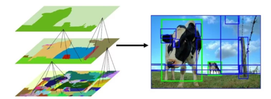
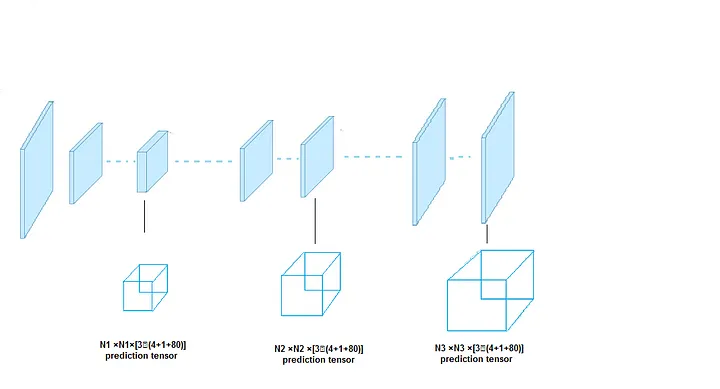

# Rozpoznawanie obiektów
## Podstawowe pojęcia
### Bounding box
Otaczamy obiekt na zdjęciu ramką i przypisujemy temu wycinkowi label.

### Instance segmentation
zaznaczamy każdy pixel obiektu specyficznym kolorem i do koloru dodajemy label. Np. jeśli na zdjęciu jest kilka osób każda otrzyma swój label person1, person2, itp..

### Semantic segmentation
działa jak instance ale zaznaczamy wszystkie obiekty na obrazie odpowiednimi kolorami. Np. jeśli na zdjęciu jest kilka osób każda otrzyma taki sam label np. person.

### Keypoints
zaznaczamy specyficzne punkty obiektu tak aby można było stworzyć szkielet np. zaznaczamy głowę, ręce, nogi i mamy szkielet człowieka.

## Tagowanie obrazu
<object-class> <x> <y> <width> <height>
gdzie x, y to współrzędne środka obrazu, a width, height to szerokość i wysokość ramki. Należy polegać na istniejących zbiorach i tworzyć własne tylko w ostateczności. Dobry zbiór - COCO - ma boundingboxy, segmentację i keypointy.

## Intersection over Union
$$ IoU = {AreaOfOverlap \over AreaOfUnion}$$
Sprawdzenie jaki jest stosunek ramki wyznaczonej przez model do ramki prawdziwej (wyznaczonej w danych testowych)
## Mean Average Precision (mAP)
$$mAP = \frac{1}{N} \sum_{i=1}^{N} {TP_i \over FP_i - TP_i }$$

Jest to wzór którym obliczamy jak dobrze nasz model wykrywa obiekty, za pomocą macierzy kowariancji.

## Sposoby wykrywania obiektów

### Sliding search

Bierzemy prostokąt/kwadrat, ustanawiamy go jako okno i przesuwamy go po całym obrazie. Potem zmieniamy wymiary okna i znowu przesuwamy po całym obrazie i tak kilka razy.

### Selective Search

Algorytm znajdujący iteracyjnie obszary podobne kolorystycznie, następnie po nich się szuka obszaru zainteresowań. Zmniejsza obszar pszeszukiwań prostokątami.

## R-CNN 2012
Pierwszy model który implementował  rozpoznawanie obiektów na obrazie. Do każdej klasy wyuczono osobno binarnie SVM'a.
### Minusy
- długo się liczy
- mamy tak po prawdzie kilka sieci neuronowych które trzeba nauczyć.
- selective search potrafi generować błędy w obszarach.

## Bounding Box Regressor
Komponent odpowiadający za poprawianie początkowo wykrytych bounding boxów w sieci.

## Jak poprawić prędkość działania

### Zastąpienie SVM siecią konwolucyjną
- wykorzystanie receptive field
- Zmiana miejsca rozpoznawania obiektu do ostatniej warstwy konwolucyji.

Krok po kroku:
1. Obrazek przepuszczany przez siec konwolucyjna
2. Wyciagamy ostatnia warstwe sieci konwolucyjnej
3. Wyliczamy z niej ROI
4. Tutaj przeprowadzamy analizę czy mamy obiekt

### Zastąpienie selective search'a modelem sieci który będzie rozróżniał obszary. (Hasło Region Proposal)
Krok po kroku:
1. Puszczamy obrazek przez siec i dostajemy ostatnią warstwę konwolucji
2. Puszczamy to do drugiej podsieci która generuje ROI
3. Wynik jest zwracany do pierwszej sieci która przeprowadza na bazie tego rozpoznania, następnie zwracane są bounding boxy i rozpoznany obiekt

## Co zrobić gdy dostaniemy za dużo bounding boxów
- Non Maxiumum Suppresion
    - patrzymy czy wszystkie bounding boxy mają tą samą klasę
    - Wybieramy ten który ma największą pewność po softmaxie
    - resztę usuwamy

## YOLO (Look bo nie live)

- dzielenie obrazku na sekcje
- dla każdej ramki trzeba proponować co w niej się znajduje.
- zaznaczamy ramki z odpowiednim znacznikiem pewności (**Confidence Score**), tym większy score, to grubsza ramka
- zozstawiamy tylko tą co ma największy CS.

## YOLO v2
Wprowadzono:
- Batch normalization
- High Resolution Classifier
### Anchor boxy
To zestaw predefiniowanych ramek (bounding boxes) o różnych proporcjach i skalach, które są używane jako punkty odniesienia dla rzeczywistych ramek otaczających obiekty w obrazie. Ułatwiają one modelowi wykrywanie obiektów o różnych rozmiarach i proporcjach, szczególnie gdy na jednym obrazie występuje wiele obiektów blisko siebie lub się nakładających.

Został wytrenowany na dwóch różnych zbiorach danych.

## YOLO v3
- zastosowanie połączeń rezydualnych
- dodanie dodatkowych wyjścć wcześniej by umieć rozróżniać wielkość elementów, wcześniejsze iteracje sobie z małymi obiektami nie radziły

 <!-- openmmlab -->

 <!-- jakie miał problem fast r-cnn -->