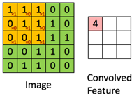
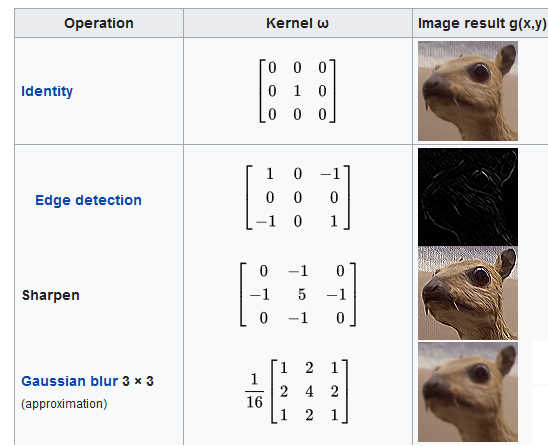
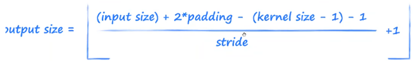

# Sieci CNN
## Problem z przerabiania obrazu na wektor
Mając długi wektor analizujemy dany piksel biorąc jego sąsiedztwo z lewej i prawej strony, nie bacząc na to co jest powyżej i poniżej. Problem można rozwiązać stosując tensory (np zestaw wektorów odzwierciedlających po jednym z kanałów RGB obrazu)

## Konwolucja

Jest to przemnożenie macierzy przez zadane jądro (kernel, filter). Np:

Pozostałe pola Convolved Feature otrzymuje się poprzez przesuwanie jądra po obrazie. Jądro może być inne na każdej warstwie i w każdej epoce.

Kernele i ich zastosowania:

### Zastosowania
- Wykrywanie wzorców
- Poprawianie jakości obrazu
- Zagłuszanie obrazu

### Co zrobić jak mamy na wejście obraz? (Wiele kanałów)
Dla każdego z kanału kolorów liczy się konwolucje, następnie sumuje się każdą konwolucję do jednej macierzy + potencjalny bias

### Kernel size
Jaki może być maksymalny rozmiar macierzy konwolucji?
Może być równy na przykład rozmiarom obrazka lecz nie jest to robione ze względów następujących:
- tracimy możliwość wyodrębnienia lokalnych cech w obrazie na bazie których mode możę poczynić klasyfikację.
- O wiele bardziej jest zwiększona złożoność obliczeniowa operacji dla takiego jądra konwolucji
- Utracenie informacji przestrzennej. Obraz byłby traktowany za każdym razem jako pojedyncza jednostka, co by się źle przełożyło na uczenie modelu.

Najczęściej stosuje się konwolucje o rozmiarach 1x1, 3x3, 5x5.

### Właściwości konwolucji
- Padding: dodanie zer dookoła wejściowej macierzy (z macierzy 6x6 robimy macierz 8x8)
- strides: rozmiar kroku w przejściu

### Wzór na wyjście z danej konwolucji

### Dilation rate
Jest to wskaźnik o ile ma się przesuwać każdy składnik kernela po np obrazie
Przykładowe zastosowanie:
- Dilation rate pozwala zwiększyć pole widzenia filtru bez konieczności zwiększania jego rozmiaru. To pozwala sieci lepiej rozumieć większe konteksty bez znacznego zwiększania liczby parametrów.
- Umożliwia przetwarzanie obrazów przy zachowaniu ich oryginalnej rozdzielczości, co jest przydatne w zadaniach takich jak segmentacja obrazów.

## Pooling
Operacja mająca na celu zredukować wymiarowość danych przy zachowaniu ważności danych.
Główne cechy:
- sieć jest mniej wrażliwa na przesunięcia w danych wejściowych
- redukcja wymiarowości
### Average pooling

Oblicza wartość średnią z określonego obszaru danych wejściowych.
Na przykład, w obszarze 2x2, average pooling będzie średnią z czterech wartości.

### Max pooling
Max pooling polega na wybraniu maksymalnej wartości z określonego obszaru danych wejściowych. Na przykład, w obszarze 2x2, max pooling wybiera największą wartość z tych czterech.