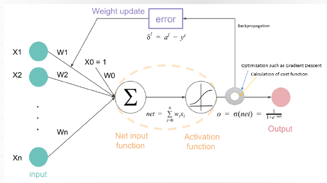

## Proces Uczenia

## Ważne modele i ich innowacje

|Model | Data powstania |Charakterystyka |
|---|---|--- |
|LesNet| 1989 | Pierwsza  sieć konwolucyjna, składa się z 7 warstw, 2 konwolucyjne 3, pełni połączonych warstw oraz 2 warstw redukujących wymiar. |
|AlexNet| 2012| Pierwsza sieć neuronowa na której zaczęto korzystać z funkcji aktywacji **ReLu** oraz **MaxPooling'u**. Wykorzystywałą również w warstwach pełni połączonych funkcję **Dropout**. Spopularyzowała deep learning poprzez osiąganie dobrych w wyników w klasyfikacji obrazów.
|ZFNet| 2013| podobny do alexnet, użył konwolucję 7x7 zamiast 11x11, zaproponowali odwróconą konwolucję dzięki czemu potrafili zwizualizować warstwy wewnątrz modelu - mogli zobaczyć na jakim fragmencie obrazka sieć się skupiała, podejmowała decyzję|
|VGGNet|2014|  spopularyzował sposób, w jaki zmieniają się rozmiar obrazka i liczba filtrów między kolejnymi warstwami (2x mniejszy obrazek, 2x więcej filtrów, aż do rozmiaru 1x1xdużo). Zauważyli, że im więcej warstw, tym lepiej (do pewnego momentu). Ten model miał już same konwolucje 3x3
|GoogleNet/Inception|2014| Rozwiązałą problem z zanikiem gradientu w głebokich sieciach neuronowych za pomocą **Auxiliary Classifiers**. Wprowadziły moduły inception, które zezwalały na liczenie konwolucji z różnymi rozmiarami filtrów w bloku. Zezwoliły one na tworzenie głębszej sieci która dalej pozostaje efektywna obliczeniowo
|Inception V3|2016| Udoskonalenie poprzedniej wersji poprzez stworzenie bardziej zaawansowanych modułów inception. Zastosowanie faktoryzacji konwolucji czyli zamiast jednej konwolucji 3x3 użyć **dwóch konwolucji** (3x1 i 1x3). Regularyzacja danych dla każdej wejściowej warstwy poprzez technikę **batch normalization**.
|Inception V4|2016| Wprowadzenie połączeń rezydualnych z ResNeta tak aby móc tworzyć jeszcze bardziej głębokie sieci bez utraty gradientu.
|ResNet|2015| **Skip Connections** (skrócone połączenia), które pozwalają sygnałom na przeskakiwanie jednej lub więcej warstw. Dzięki temu gradienty mogą płynąć bezpośrednio przez sieć, co zmniejsza problem zanikającego gradientu w głębokich sieciach. Głęboka Architektura: sieci o znacznej głębokości, z wersjami zawierającymi od 18 do nawet 152 warstw, co było nieosiągalne w poprzednich architekturach
| Unet| 2015 |  U-Net składa się z dwóch głównych części: enkodera, który koncentruje się na przechwytywaniu kontekstu obrazu (downsampling), i dekodera, który umożliwia precyzyjną lokalizację (upsampling).
|Xception|2017| Zastosowanie **Depthwise Separable Convolutions**  (separowalnych konwolucji głębokich): każdy kanał z osobna konwolujemy, a potem konwolucją 1x1 łączymy te wyniki - znacząco zmniejsza liczbę operacji.
|ResNetXt|2017| Grupowane konwolucje (grouped convolutions). W przeciwieństwie do standardowej konwolucji, gdzie każdy filtr jest stosowany do wszystkich kanałów wejściowych, grupowane konwolucje dzielą wejście na grupy, a każdy filtr jest stosowany tylko do swojej grupy kanałów.
|DenseNet|2017| każda warstwa jest bezpośrednio połączona ze wszystkimi innymi warstwami, które są głębiej, czyli wyjście z każdej warstwy jest używane jako wejście do wszystkich kolejnych warstw. To podejście ułatwia liczenie gradientu i zmniejsza ryzyko Jego zaniku
|Dual path networks|2017|  integruje koncepcję rezydencyjnych (residual) połączeń z ResNet z gęstymi (dense) połączeniami z DenseNet. Pozwala to na efektywne przekazywanie informacji i gradientów przez sieć.
| Squeeze-and-excitation networks - SENet |2018| : Moduły SE, które skutecznie modelują zależności między kanałami w mapach cech. Moduły te pozwalają sieci na dynamiczne dostosowanie wag poszczególnych kanałów, co zwiększa jej zdolność do wyłapywania użytecznych informacji. Część  squeeze agreguje informacje globalne z mapy cech,  część excitation (pobudzenie) wykorzystuje te informacje do modulacji wag kanałów.
| NASNet |2018| Użyto sieci rekurencyjnych i reinforced learning. Pozwolono modelowi, aby sam dobierał parametry (wybierał dwa ukryte stany, potem wybierał operacje, jakie wykonać na tych stanach, a potem operację do połączenia tych stanów - te operacje powtarza dla losowo wybranych nowych i starych ukrytych stanów).
|AmoebaNet | 2019 | użycie algorytmu ewolucyjnego zamiast reinforced learning (w NASNet). Sieć cechuje problem z pamięcią bo przechowujemy kolejne generacje algorytmu.
| EfficientNet |2019| (Compound Scaling) zastosowanie metody skalowania wielowymiarowego, która jednocześnie zwiększa głębokość, szerokość i rozdzielczość sieci w zbilansowany sposób.
| Vision Transformer ViT | 2020 | podział obrazka na kilka części (patch), przetworzenie każdej na słowo, użycie otrzymanego zdania w Transformer Encoder. Model wymaga bardzo dużego zbioru danych aby być w stanie się nauczyć.