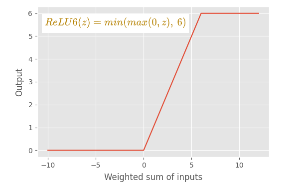

## Problemy
- mniejsza moc obliczeniowa
- chcemy jak najszybciej by to działało
- moc baterii

## Rozwiazania
- Wysyłać na serwer
- Zmniejszyć rozmiar modelu
- Zmniejszyć dokładność operacji

## SqueezeNet (2016)
- wykorzystanie konwolucji 1x1 by zmniejszyć ilość kanałów (rozmiar sieci) i szybciej przetwarzać dane

## MobileNet (2017)
- Zastosowanie najpierw depthwise convolution i potem pointwise convolution (czyli 1x1)
- Wykorzystanie strife'u do gradientu

## Relu6

Używane w sieciach na urządzenia mobilne bądź IOT ze względu na to że jest bardziej odporne na liczby o małej precyzji

## MobileNet v2 (2018)
- połączenia rezydualne (Gradient gradient gradient...)
- najpierw pomniejszać liczbę kanałów a potem ją znowu powiększać.

## Mobilenet v3
- dodanie liczenie wag z Seneta
- zmiana global average pooling i linear na jedną konwolucję 1x1 zwracającą 1000 klas

## GhostNet
- Wprowadzenie "ghost modules", które generują więcej cech przy użyciu mniej zasobów obliczeniowych. Robią to poprzez generowanie dodatkowych "ghost" (duchowych) cech z istniejących map cech za pomocą prostych operacji, takich jak liniowe transformacje.

<!-- TODO: Wrzuc zdjęcie z prezki -->

