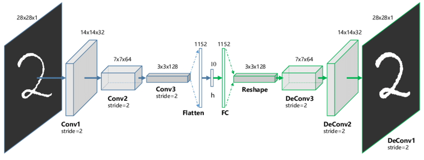
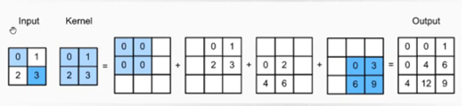
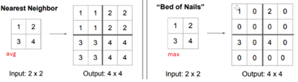

## Metody augumentacji danych
- Flip - tworzenie odbicia lustrzanego obrazka
- Rotate - obracanie obrazka
- scale - Skalowanie obrazka
- Luki  - Wycinanie na rogach obrazka fragmentów i uzupełnianie ich czymś nowym
- crop  - wycinanie fragmentu obrazka
- noise - nakładanie szumu gaussowskiego na obrazek
- color jitter - Nakładanie
- Sieci GAN
- Mixup - nakładamy warstwą przeźroczystości jeden obrazek na drugi
- CutMix - wycinamy część obrazka i wkładamy go w drugi.
## Kiedy używać augumentacji danych?
- Ograniczona ilość danych.
- Niesymetryczny zbiór danych
- Małe zróżnicowanie zbioru
- czyli inaczej zawsze kiedy jest na to potrzeba.
## Czy wykorzystywać wszystko co mamy pod ręką
Zależy od sytuacji, niektóre augumentacje mogą mieć sens w określonym tylko kontekście np obrót zdjęcia ulicy o 90 może mieć sens a portretu już nie. Najlepiej jest zaczynać od tych najprostszych augumentacji a potem przechodzić do tych bardziej złożonych
Ważne jest to aby wykorzystana augmentacja miała odwzorowanie w środowisku w którym model będzie miał zastosowanie. Jeżeli chcemy rozpoznać na przykład cyfry na tablicach rejestracyjne to przyda się zastosować takie modyfikacje, które dostosują model do pracy w warunkach gdzie obraz nie zawsze będzie w dobrej jakości.

## Ile trzeba przykładów generować?
W zależności od złożoności modelu, tym bardziej złożony tym więcej danych może być potrzebne aby takowy nauczyć, choć trzeba
też pamiętać o tym aby nasze wygenerowane dane nie doprowadziły do **przeuczenia** sieci. Ważne jest wtedy aby zachować różnorodność technik jakie zastosujemy do generacji nowych danych, oraz monitorować zachowania się sieci na zbiorze walidacyjnym. Aby stworzyć optymalną liczbę obrazków trzeba w takim razie iteracyjnie testować poprzez generowanie coraz to więcej danych aż dojdziemy do optymalnej ilości.

## Co to jest regularyzacja sieci
Są to metody mające na celu poprawić generalizację modelu sieci neuronowej, aby uczyła się wzorców a nie danych.

### Regularyzacja L1
- Dodaje karę równą sumie absolutnych wartości wag, co może prowadzić do zerowania niektórych wag, a więc do prostszego modelu.
### Regularyzacja L2
- Dodaje karę równą sumie kwadratów wag, co zwykle prowadzi do mniejszych wartości wag, ale nie eliminuje ich całkowicie.

### Overfitting
- Przeuczenie się modelu, można je zauważyć na bazie analizy porównawczej wykresu funkcji straty i accuracy, kiedy zauważymy, że funkcja ta zaczyna ponownie rosnąć a accuracy na zbiorze treningowym dalej rośnie.

### Early stopping
Polega na monitorowaniu wydajności modelu na zbiorze walidacyjnym podczas treningu i zatrzymaniu procesu uczenia, gdy wydajność na zbiorze walidacyjnym zaczyna się pogarszać, co wskazuje na rozpoczęcie procesu przeuczenia. Model o najlepszej wydajności na zbiorze walidacyjnym jest zapamiętywany.
### Batch normalization
technika, która normalizuje dane wejściowe każdej warstwy. Ma na celu przyspieszenie treningu oraz zwiększenie stabilności procesu uczenia poprzez redukcję problemu zwanego "internal covariate shift" (zmiany wewnętrznej dystrybucji danych wejściowych w trakcie uczenia). Technika ta polega na normalizacji danych wejściowych dla każdej partii (batch) do średniej równej zero i wariancji równej jeden, co pomaga w utrzymaniu danych w dobrym zakresie do przetwarzania przez sieć.

## Label smoothing
technika mająca na celu poprawę generalizacji modelu poprzez zmniejszenie pewności sieci na wyjściach. W tradycyjnym podejściu, dane treningowe są zazwyczaj etykietowane za pomocą tzw. "hard labels", czyli deterministycznych etykiet (np. 1 dla prawidłowej klasy i 0 dla pozostałych). Label Smoothing wprowadza "soft labels", czyli zmienia te etykiety na wartości, które są nieco mniej ekstremalne.
Przykładowo, zamiast używać 0 i 1, etykieta dla prawidłowej klasy może zostać zmieniona na 0.9, a pozostałe klasy podzielą między siebie pozostałą wartość (np. 0.1 podzieloną równomiernie). Ta technika pomaga w uniknięciu nadmiernego dopasowania modelu do danych treningowych (overfitting) i zwiększa jego zdolność do generalizacji, ponieważ uczy model, żeby nie był zbyt pewny swoich predykcji, co jest korzystne w praktycznych zastosowaniach, gdzie dane mogą być bardziej zróżnicowane i mniej pewne.
## Model EMA (Exponential Moving Average)
Jest to technika śledzenia średniej ważonej parametrów modelu na przestrzeni czasu, gdzie większa waga przykładana jest do bardziej aktualnych wartości. Ta technika jest stosowana do stabilizacji i potencjalnej poprawy wydajności modeli uczenia głębokiego.
- Wykorzystanie Średniej Ważonej: EMA oblicza średnią ważoną parametrów modelu, gdzie nowsze wartości mają większą wagę. Algorytm przykłada więcej wagi do najnowszych danych, co czyni ją bardziej odpowiednią do dynamicznych warunków.
- Stabilność Parametrów: Przez wygładzanie fluktuacji w wartościach parametrów modelu na przestrzeni czasu, EMA może pomóc w stabilizacji procesu uczenia, szczególnie w scenariuszach z dużą wariancją w aktualizacjach parametrów.

## Transfer learning
Technika w której model wytrenowany na jednym zadaniu jest adaptowany do innego, związanego zadania. Na przykład, model wytrenowany na rozpoznawaniu obrazów może zostać dostosowany do konkretnego zadania klasyfikacji obrazów. Jest to szczególnie skuteczne, gdy dostępne są ograniczone ilości danych dla nowego zadania, ponieważ model wykorzystuje wiedzę nabytą podczas pierwotnego treningu.
## Fine tuning
to  proces dalszego trenowania wstępnie wytrenowanego modelu na nowym zbiorze danych, często w kontekście transfer learning. W tym procesie, parametry modelu są "dopasowywane", aby lepiej pasowały do specyfików nowego zadania. Fine tuning może obejmować trening całego modelu z nowymi danymi lub tylko jego części, na przykład ostatnich warstw sieci neuronowej.

## Style trasnfer
z jednego zdjęcia bierzemy content z drugiego styl. Pierwsze warstwy bardziej się tyczą wyglądu kontekstu, a ostatnie bardziej szczegółowe. Pierwsze warstwy styl, ostatnie konten

## Autoenkoder
Sieć neuronowa, która będzie potrafiła zapisać zdjęcie jako kod, a potem rozkodować to i odzyskać zdjęcie
Służą też do odszumiania i do deep fake

### Dekonwolucja

### Depooling

